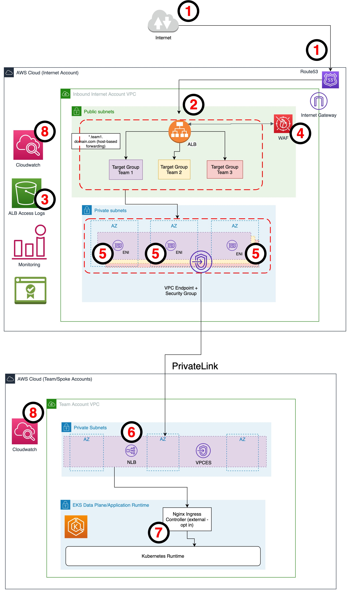

## Central Application Loadbalancer Ingress for private EKS VPCs Terraform

This repository contains Terraform code implementation of a centralized internet ingress setup for EKS services hosted in private/separate AWS accounts/VPCs with no public link [(IGW/NAT)](https://docs.aws.amazon.com/network-firewall/latest/developerguide/arch-igw-ngw.html) attached.


## Solution diagram and data flow


The diagram that follows shows how traffic from the internet flows to the services hosted in the Amazon EKS VPC. following these:

1.	HTTPS requests coming from the internet are resolved by [Amazon Route 53 DNS](https://aws.amazon.com/route53/) and then directed to the public address of the [ALB](https://docs.aws.amazon.com/elasticloadbalancing/latest/application/introduction.html).
2.	The ALB terminates the HTTPS traffic using a certificate managed by [AWS Certificate Manager](https://aws.amazon.com/certificate-manager/).
3.	Traffic that is permitted to pass through the ALB is then logged in [S3](https://aws.amazon.com/s3/).
4.	Traffic is then reviewed and screened by the [AWS Web Application Firewall (WAF)](https://aws.amazon.com/waf/) to catch common security exploits. Assuming the HTTP request is permitted by the WAF, traffic is then routed to the ALB targets (VPC Endpoint ENIs).
5.	The ALB load balances the traffic against the ENIs defined for the VPC Endpoint.
6.	Once traffic arrives at the ENIs associated with the VPC Endpoint, the [PrivateLink](https://aws.amazon.com/privatelink/?privatelink-blogs.sort-by=item.additionalFields.createdDate&privatelink-blogs.sort-order=desc) service carries the traffic to the Amazon EKS VPC, where the VPC Endpoint Service maps the traffic to the NLB.
7.	The NLB, with HTTP targets defined in the Amazon EKS cluster, delivers the HTTP traffic to the service hosted on the pods running in the Amazon EKS cluster.
8.	All ALB and Amazon EKS logs are logged in [Amazon CloudWatch](https://aws.amazon.com/cloudwatch/).





**Benefits:**

- This solution separates duties between 1) the governance of the ALB security, certificate management, and integration with WAF services in the internet VPC, and 2), application management in the Amazon EKS VPC.
- Application teams in the Amazon EKS VPCs keep their services isolated inside their VPC until they are configured the PrivateLink service and given access external parties.
- With one centrally-managed internet VPC, it is simpler to perform security audits on inbound internet access.
- Network access between all VPCs is controlled by a single networking approach using PrivateLink.

### Solution Concerns:

- While this solution is beneficial for connecting multiple workload VPCs to a central inbound internet solution, it  becomes difficult to manage at scale. This is because configuring new services and connecting additional Amazon EKS VPCs requires additional IP space within the internet VPC.

- By default, the quota for VPC Endpoints defined within a VPC is 50 (you can increase this quota with a service quota increase request). Alternatively, we could create another internet VPC along with another ALB to shard some of the inbound traffic and mitigate the concerns of the VPC Endpoint limits.

### Walk-through

*Pre-requisites*

1. For this solution, we require access to at least one AWS account
2. We based the codebase for this solution on [Terraform version >= 12](https://learn.hashicorp.com/tutorials/terraform/install-cli)
3. The codebase for this solution requires the [aws cli v2](https://docs.aws.amazon.com/cli/latest/userguide/install-cliv2.html)
4. Before starting a Terraform, double-check that the AWS provider role definitions and the correct AWS account ID are properly configured
5. AWS cli profiles setup: https://docs.aws.amazon.com/cli/latest/userguide/cli-configure-profiles.html
   for eks-service-account: we use default cli profile. Whereas for central-internet-account: we use profile name: central-acc
   the cli creds file should look like this:


### Repository structure

As a starting point, download the contents of this GitHub repository.

A description of the structure of the code follows:


```bash
.
|-- README.md
|-- central-internet-acc-setup
|-- eks-service-account

```
The central-internet-acc-setup directory contains the Terraform code for the central Internet VPC.

The eks-service-account directory contains the Terraform code for the EKS VPC.

## Detailed setup

### Setup eks-service-account

Follow the following set of steps in order to set up eks-service-account:

#### 1. Create terraform state bucket for this account by executing the following command in terminal. The s3 bucket-name used in the code base is `eks-service-account`

```bash
$ cd eks-service-account
$ sh s3_state_buckets.sh <S3_BUCKET_NAME_as_input>  <REGION_as_input>  default
```

#### 2. Update the s3 bucket name created in the above step 1 to terraform backends (terraform/backend.tf) for roles, networking-setup and eks-cluster-setup directories

roles/terraform/backend.tf
```terraform
terraform {
  backend "s3" {
    bucket     = "<eks-service-account-bucket-name>" 
    region     = "eu-central-1"
    key        = "roles"
  }
}
```

networking-setup/terraform/backend.tf
```terraform
terraform {
  backend "s3" {
    bucket     = "<eks-service-account-bucket-name>" 
    region     = "eu-central-1"
    key        = "networking-setup"
  }
}
```

eks-cluster-setup/eks/terraform/backend.tf
```terraform
terraform {
  backend "s3" {
    bucket     = "<eks-service-account-bucket-name>" 
    region     = "eu-central-1"
    key        = "eks-cluster-setup"
  }
}
```

eks-cluster-setup/ingress-plugin-module/terraform/backend.tf
```terraform
terraform {
  backend "s3" {
    bucket     = "<eks-service-account-bucket-name>" 
    region     = "eu-central-1"
    key        = "nginx-ingress"
  }
}
```

#### 3. Create IAM Roles

Create the following IAM roles with required permissions:

- network-role
- iam-full-access
- ecr-full-access
- eks-role

```bash
$ cd roles/terraform
  terraform init
  terraform plan
  terraform apply -auto-approve

```

#### 4. Networking setup

Create the following resources:

- VPC (default cidr: 10.11.0.0/16)
- 3 completely private subnets (one in each Availability Zone with no NAT/IGW connectivity)
- VPC Endpoints (ecr, s3, ec2, lb, sts and autoscaling)
- ECR repository (with name: eks-service-account-ecr)

```bash
$ cd networking-setup/terraform
  terraform init
  terraform plan
  terraform apply -auto-approve

```

#### 5. Upload the Nginx ingress to the ECR repository

Since the EKS dataplane has no internet link/connectivity, you must push the docker image of the Nginx ingress controller in the private ECR repository

- Pull the Nginx ingress controller image
```bash

$ docker pull k8s.gcr.io/ingress-nginx/controller:v0.46.0@sha256:52f0058bed0a17ab0fb35628ba97e8d52b5d32299fbc03cc0f6c7b9ff036b61a
```

- List images and note the IMAGE ID of the downloaded image
```bash
$ docker images
``` 

- Tag docker image. Replace the <IMAGE-ID> and <your-aws-account-id> in the following command with correct values.
```shell 
$ docker tag <IMAGE-ID> <your-aws-account-id>.dkr.ecr.eu-central-1.amazonaws.com/eks-service-account-ecr
```

- ECR Login and Push Image to ECR
```bash
$ aws ecr get-login-password --region eu-central-1 | docker login --username AWS --password-stdin <your-aws-account-id>.dkr.ecr.eu-central-1.amazonaws.com/eks-service-account-ecr
$ docker push <your-aws-account-id>.dkr.ecr.eu-central-1.amazonaws.com/eks-service-account-ecr
````


#### 6. EKS Cluster Setup

This step creates:

- EKS cluster control plane
- EKS cluster data plane with managed worker nodes
- Deploy Nginx ingress controller in a separate namespace with AWS NLB
- VPC endpoint service with the NLB created in the previous step

```bash
$ cd eks-cluster-setup/eks/terraform
  terraform init
  terraform plan
  terraform apply -auto-approve
```

#### 7. Deploy nginx-ingress-controller

```bash
$ cd eks-cluster-setup/ingress-plugin-module/terraform
terraform init
terraform plan
terraform apply -auto-approve
```

### Setup central-internet-account

#### 1. Create terraform state bucket for this account by running this command in terminal:

```bash
$ cd central-internet-account-setup
$ sh s3_state_buckets.sh <S3_BUCKET_NAME_as_input>  <REGION_as_input>  central-acc
```

#### 2. Update the s3 bucket name created in the preceding step to Terraform backends (terraform/backend.tf) for roles, networking-setup directories

roles/terraform/backend.tf

```terraform
terraform {
  backend "s3" {
    bucket     = "<eks-service-account-bucket-name>" 
    region     = "eu-central-1"
    key        = "roles"
  }
}
```

networking-setup/terraform/backend.tf

```terraform
terraform {
  backend "s3" {
    bucket     = "<eks-service-account-bucket-name>" 
    region     = "eu-central-1"
    key        = "networking-setup"
  }
}
```

#### 3. Networking Setup

This step will create following resources:

- VPC (default cidr: 10.12.0.0/16)
- 3 completely private subnets - for vpc endpoint
- 3 public subnets for application loadbalancer that would serve as an entry point for traffic
- 1 VPC Interface Endpoint which will make a connection with VPCES created in the eks-service account
- WAF
- NLB target groups pointing to VPC endpoint private ENI IPs.

```shell
$ cd networking-setup/terraform
  terraform init
  terraform plan
  terraform apply -auto-approve
```
### Adding a new VPC Connection/Account

In order to connect additional VPCs to the centralized internet-ingress account, the eks-service-account code is replicated/extended to provision the additional subscriber VPC or AWS accounts. During the creation of the VPC Endpoint Service in the eks-service-account, you must define a unique name for each service that is referenced in the centralized internet-ingress account, in order to create the associated VPC endpoints.
We use the VPC Endpoint Service names and AWS Systems Manager Parameter Store to share the centralized internet-ingress account. Parameter Store elements can be secrets or plain-text values you reference in your scripts, commands, SSM documents, configurations, and automation workflows by using the unique name that you specified when you created the parameter. In our case, as part of ingress-plugin-module setup in eks-service-account, the VPC endpoint service name is automatically deployed to the central-account’s Parameter Store, which is then consumed by central-account-setup natively using terraform at the time of each endpoint creation.
The Parameter Store name must be unique, so that for every new VPC endpoint, terraform automation does not override a previously deployed or active VPC endpoint service. In our scenario, this is handled by a Terraform variable called connection_name.  Hence, for every additional eks-service-account setup, the connection_name variable has to be unique.

- The connection_name variable is handled in the file: eks-service-account/eks-cluster-setup/ingress-plugin-module/nginx.tf:

```hcl

resource "aws_ssm_parameter" "vpces-service-name" {
provider = aws.central-acc
name = "vpces-service-name-${var.connection_name}"
type = "String"
value = aws_vpc_endpoint_service.nginx-ingress-public.service_name
depends_on = [aws_vpc_endpoint_service.nginx-ingress-public]
overwrite = true
}

```

- When you add a new connection, declare a new endpoint module and target group reference in the central-internet-account-setup/networking-setup/terraform/main.tf:

```hcl
module "endpoint-new" {
providers = {
aws.network-role = aws.network-role
}
source = "./modules/endpoints"
vpc_id = module.vpc.vpc_id
public-ingress-subnet-cidrs = module.vpc.public_ingress_subnet_cidrs
private-endpoint-subnet-ids = module.vpc.private_endpoint_subnet_ids
endpoint_service_name = data.aws_ssm_parameter.endpointservice-new.value

}

module "target-group" {
providers = {
aws.network-role = aws.network-role
}
source = "./modules/target-group"
name   = "internet-ingress-new"
vpc_id = module.vpc.vpc_id
listener_arn = module.alb.alb_https_listener_arn
team_endpoint_private_ips = toset(module.endpoint.eni_ips)
}

```


- To deploy the new configuration, run the following Terraform:

```shell

$ terraform plan central-internet-account-setup/networking-setup/terraform/ -auto-approve

$ terraform apply central-internet-account-setup/networking-setup/terraform/ -auto-approve

```

### Cleaning up

When finished, you can clean up your account by following these steps in order:

1.	Switch to this working directory:

```shell
$ cd central-eks-internet-ingress
```

2.	Clean up central internet account services

```shell

$ terraform destroy central-internet-account-setup/networking-setup/terraform -auto-approve
$ terraform destroy central-internet-account-setup/roles/terraform -auto-approve
```

3.	Clean up the EKS service account services:

```shell
$ terraform destroy eks-service-account/eks-cluster-setup/ingress-plugin-module/terraform -auto-approve
$ terraform destroy eks-service-account/eks-cluster-setup/eks/terraform -auto-approve
$ terraform destroy eks-service-account/networking-setup/terraform -auto-approve
$ terraform destroy eks-service-account/roles/terraform -auto-approve
```

## Security

See [CONTRIBUTING](CONTRIBUTING.md#security-issue-notifications) for more information.

## License

This library is licensed under the MIT-0 License. See the LICENSE file.
