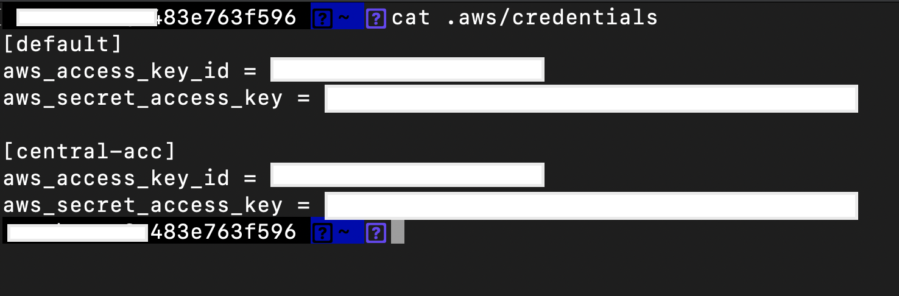

## Central Application Loadbalancer Ingress for private EKS VPCs Terraform

This repository contains the terraform code implementation of a centralized internet ingress setup for EKS services hosted in private/separate AWS accounts with no public link (IGW/NAT) attached. 

### Repository Structure
The setup is essentially divided into following two parts:

```bash
.
|-- README.md
|-- central-internet-acc-setup
|-- eks-service-account

```
### 1. Central Internet Account Setup

This account will spin up following resources:

1. VPC with Internet Gateway
2. Application Load Balancer
3. WAF with managed AWS rules
4. VPC Endpoints destined for private link with EKS service Accounts

### 2. EKS Service Account

This account will spin up following resources:

1. VPC (without IGW or NATGW)
2. A private EKS cluster with managed worker nodes
3. Nginx ingress plugin simple configuration
4. VPC endpoint service that automatically accepts the endpoint created in the Central Internet Account Setup
5. A sample app/service exposed via Private Link over the internet (to be decided)

### Architecture

The following architecture diagram simplifies the proposed solution. 


AWS Services Involved: 

1.	Route53 (Public hosted Zone with records pointing to ALB cname).
2.	ACM (Publicly signed certificate either imported or requested via certificate manager).
3.	VPC (for networking layer and public and private subnets) in the internet account.
4.	Application Load Balancer with listener rule configured to forward requests based on host-header.
5.	S3 for ALB access logs
6.	VPC interface endpoint in internet account and VPCES in the spoke accounts (Private Link).
7.	ALB Target Groups (one for each spoke) with 3x eni IPs registered as targets for the respective VPC endpoint(s).
8.	Security Groups (ALB and VPCE level) allowing specific inbound traffic to flow.
9.	AWS WAF Web ACL with AWS Managed Core Rule Set (to protect against common attacks).
10.	VPC Endpoint Services deployed in each spoke account with Network Load Balancer.
11.	One Nginx ingress controller for each of the spoke account(s) in the EKS plane.
12.	Cloudwatch for monitoring

### Prerequisites

The following prerequisites are necessary in order to run the example.

- [Terraform version >= 12](https://learn.hashicorp.com/tutorials/terraform/install-cli)
- [aws cli v2](https://docs.aws.amazon.com/cli/latest/userguide/install-cliv2.html)
- Also before executing the terraform, aws provider role definitions and correct aws account ids needs to be checked.
- 2 AWS accounts (1. eks-service-account and 2. central-internet-acc)
- 2 AWS cli profiles setup: https://docs.aws.amazon.com/cli/latest/userguide/cli-configure-profiles.html
  for eks-service-account: we use default cli profile
  for central-internet-account: we use profile name: central-acc
  the cli creds file should look like this:




## `/eks-service-account` - Account 1
  

### Directory Structure

```bash
$ cd eks-service-account
```

```bash
|-- eks-service-account
    |-- eks-cluster-setup
        |-- eks
            |-- terraform
        |-- ingress-plugin-module
            |-- terraform
    |-- networking-setup
        |-- terraform
    |-- roles
        |-- terraform
|-- s3_state_buckets.sh
```

#### Installation Steps

### 1. Create terraform state bucket for this account by executing the following command in terminal. The s3 bucket-name used in the code base is `eks-service-account`

```bash
$ cd eks-service-account
$ sh s3_state_buckets.sh <S3_BUCKET_NAME_as_input>  <REGION_as_input>  default
```

### 2. Update the s3 bucket name created in the above step to terraform backends (terraform/backend.tf) for roles, networking-setup and eks-cluster-setup directories 

roles/terraform/backend.tf
```
terraform {
  backend "s3" {
    bucket     = "<eks-service-account-bucket-name>" 
    region     = "eu-central-1"
    key        = "roles"
  }
}
```

networking-setup/terraform/backend.tf
```
terraform {
  backend "s3" {
    bucket     = "<eks-service-account-bucket-name>" 
    region     = "eu-central-1"
    key        = "networking-setup"
  }
}
```

eks-cluster-setup/eks/terraform/backend.tf
```
terraform {
  backend "s3" {
    bucket     = "<eks-service-account-bucket-name>" 
    region     = "eu-central-1"
    key        = "eks-cluster-setup"
  }
}
```

eks-cluster-setup/ingress-plugin-module/terraform/backend.tf
```
terraform {
  backend "s3" {
    bucket     = "<eks-service-account-bucket-name>" 
    region     = "eu-central-1"
    key        = "nginx-ingress"
  }
}
```

### 3. Create IAM Roles

This step will create following IAM roles with required permissions:

- network-role 
- iam-full-access 
- ecr-full-access
- eks-role

```bash
$ cd roles/terraform
  terraform init
  terraform plan
  terraform apply -auto-approve

```

### 4. Networking Setup

This step will create following resources:

- VPC (default cidr: 10.11.0.0/16)
- 3 completely private subnets (one in each Availability Zone with no NAT/IGW connectivity)
- VPC Endpoints (ecr, s3, ec2, lb, sts and autoscaling)
- ECR repository (with name: eks-service-account-ecr)

```bash
$ cd networking-setup/terraform
  terraform init
  terraform plan
  terraform apply -auto-approve

```

### 4. Uploading the Nginx ingress to the ECR repository

Since the EKS dataplane will have no internet link/connectivity, therefore we will have to push the docker image of Nginx ingress controller in the private ECR repository

- Pull the Nginx ingress controller image
```bash

$ docker pull k8s.gcr.io/ingress-nginx/controller:v0.46.0@sha256:52f0058bed0a17ab0fb35628ba97e8d52b5d32299fbc03cc0f6c7b9ff036b61a
```

- List images to note the IMAGE ID of the downloaded image
```bash
$ docker images
``` 

- Tag docker image. Please replace the <IMAGE-ID> and <your-aws-account-id> in the following command with correct values.
```bash 
$ docker tag <IMAGE-ID> <your-aws-account-id>.dkr.ecr.eu-central-1.amazonaws.com/eks-service-account-ecr
```

- ECR Login and Push Image to ECR
```bash
$ aws ecr get-login-password --region eu-central-1 | docker login --username AWS --password-stdin <your-aws-account-id>.dkr.ecr.eu-central-1.amazonaws.com/eks-service-account-ecr
$ docker push <your-aws-account-id>.dkr.ecr.eu-central-1.amazonaws.com/eks-service-account-ecr
````


### 5. EKS Cluster Setup

This step will create following resources

- EKS cluster control plane
- EKS cluster data plane with managed worker nodes
- Deploy Nginx ingress controller in a separate namespace with AWS NLB
- VPC endpoint service with the NLB created in the previous step

```bash
$ cd eks-cluster-setup/eks/terraform
  terraform init
  terraform plan
  terraform apply -auto-approve
```

### 6. Deploy nginx-ingress-controller

```bash
$ cd eks-cluster-setup/ingress-plugin-module/terraform
terraform init
terraform plan
terraform apply -auto-approve
```


## `/central-internet-acc-setup` - Account 2

### Directory Structure

```bash
$ cd central-internet-account-setup
```

```bash
|-- central-internet-account-setup
    |-- networking-setup
        |-- terraform
    |-- roles
        |-- terraform
|-- s3_state_buckets.sh
```

### 1. Create terraform state bucket for this account by executing the following command in terminal.

```bash
$ cd central-internet-account-setup
$ sh s3_state_buckets.sh <S3_BUCKET_NAME_as_input>  <REGION_as_input>  central-acc
```

### 2. Update the s3 bucket name created in the above step to terraform backends (terraform/backend.tf) for roles, networking-setup and eks-cluster-setup directories

roles/terraform/backend.tf

```
terraform {
  backend "s3" {
    bucket     = "<eks-service-account-bucket-name>" 
    region     = "eu-central-1"
    key        = "roles"
  }
}
```

networking-setup/terraform/backend.tf

```
terraform {
  backend "s3" {
    bucket     = "<eks-service-account-bucket-name>" 
    region     = "eu-central-1"
    key        = "networking-setup"
  }
}
```

### 3. Networking Setup

This step will create following resources:

- VPC (default cidr: 10.12.0.0/16)
- 3 completely private subnets - for vpc endpoint
- 3 public subnets for application loadbalancer that would serve as an entry point for traffic  
- 1 VPC Interface Endpoint which will make a connection with VPCES created in the eks-service account
- WAF
- NLB target groups pointing to VPC endpoint private ENI IPs. 

```bash
$ cd networking-setup/terraform
  terraform init
  terraform plan
  terraform apply -auto-approve
```

## Security

See [CONTRIBUTING](CONTRIBUTING.md#security-issue-notifications) for more information.

## License

This library is licensed under the MIT-0 License. See the LICENSE file.